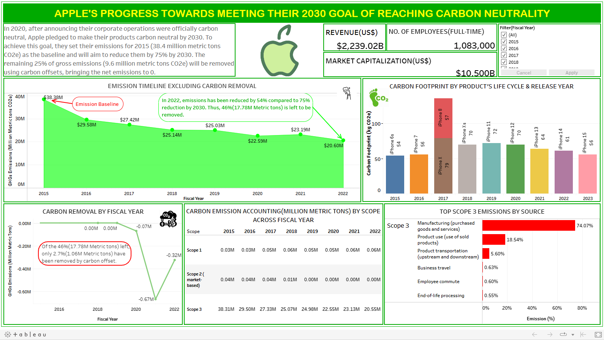

# APPLE’S PROGRESS TOWARDS REACHING CARBON NEUTRALITY BY 2030

## INTRODUCTION 
This is my entry in the environmental challenge organized by [Maven Analytics](https://mavenanalytics.io/challenges/maven-environmental-challenge/27). It focuses on visualizing Apple’s progress toward meeting their 2030 goal of reaching carbon neutrality (Carbon neutrality is when the amount of carbon emissions released is equal to the amount removed or offset, resulting in a net zero impact on the environment) across their cooperate operations and entire product life cycle.

## ABOUT THE DATASET
The dataset provided consist of 3 tables. The tables and the columns present therein can be found below:

- Carbon footprint by product: Release year, product, baseline storage & carbon footprint
- Greenhouse gas emissions: Fiscal year, category, type, scope, description & emissions
- Normalizing factors: Fiscal year, revenue, market capitalization & employees.

## PROBLEM STATEMENT: 
For the Maven Environmental Challenge, I'll be working as an independent journalist and data viz enthusiast. My task is to use the data provided by Apple in their Environmental Progress Reports to visualize their progress towards becoming carbon neutral in 2030.

## FINDINGS & VISUALIZATION

To interact with the dashboard, [Click here.](https://public.tableau.com/app/profile/sherif.atanda/viz/Apples_Progress_Towards__2030_Carbon_Neutrality/ApplesCarbonNeutrality?publish=yes)

## INSIGHTS
1.	During the exploratory data analysis, I found out that in 2022, Apple had reduced its carbon emissions by 54% compared to the baseline year of 2015. Apple's initial target was a 75% reduction by 2030. However, Apple did make some progress towards its target, with 2.7% out of the remaining 46% of emissions being offset through carbon offsetting initiatives. This implies that while Apple has work to do to meet our 2030 goal, its efforts to reduce emissions are making a positive impact.
2.	Apple's product carbon footprint showed an upward trend from 2015 to 2019. However, starting in 2020, there has been a noticeable decline in the carbon footprint associated with the products they release. This has a positive impact on the company (such as improved reputation, cost savings, competitive edge, etc.) and also provides environmental benefits.
3.	The timeframe during which carbon was actively removed from the atmosphere spanned from 2020 to 2022, with the peak occurring in 2021.
4.	Based on the GHG emissions accounting methods (Scope 1, 2, and 3),
   -	Scope 1: These are the emissions from operations owned or controlled by the reporting company. Examples include emissions from an owned or controlled furnace, a vehicle, chemical production, etc.
   -	Scope 2: This is the emission from the generation of purchased or acquired electricity, heating, or cooling consumed by the reporting company.
   -	Scope 3: This involves all indirect emissions (not included in scope 2) that occur in the value chain of the reporting company. This includes both upstream and downstream emissions. An example includes emissions from the transportation of purchased products.
 Of these three, scope 3 has been responsible for over 90% of GHG emissions over the years.
5.	By further investigating the Scope 3 emissions and the factors responsible for them. The top five (5) were emissions from manufacturing on the part of the supplier, product use and transportation, etc.
6.	Also, as the company pursues its goal of achieving net-zero emissions, it has seen a simultaneous growth in revenue, market capitalization, and the size of its workforce over the years. This is useful in building stakeholder confidence and promoting the company as a brand.

## RECOMMENDATION
1.	Consider investing in more carbon offset projects to compensate for emissions that cannot be eliminated directly.
2.	Scope 3 emissions can be reduced by engaging suppliers and encouraging them to measure and reduce emissions. Also collaborating with suppliers to adopt more sustainable      and energy-efficient production methods.
3.	Regularly monitor, measure, and report emissions data for accountability towards the 2030 goal.
4.	Focus on designing products that are more energy-efficient and have a lower impact during their use phase.
5.	Promote virtual meetings and telecommuting to reduce the need for business travel. Encourage employees to use public transportation, carpool, or use low-emission   
    vehicles when travel is necessary.
 
## CONCLUSION
 Apple has made significant strides in their commitment to achieving carbon neutrality by 2030, reaching the halfway mark in their journey. Their dedication to sustainability not only benefits the company's reputation and profitability but also has a profound positive impact on the environment. By continuing their efforts, Apple is not only setting a remarkable example for the corporate world but also actively contributing to a greener, more sustainable future.

